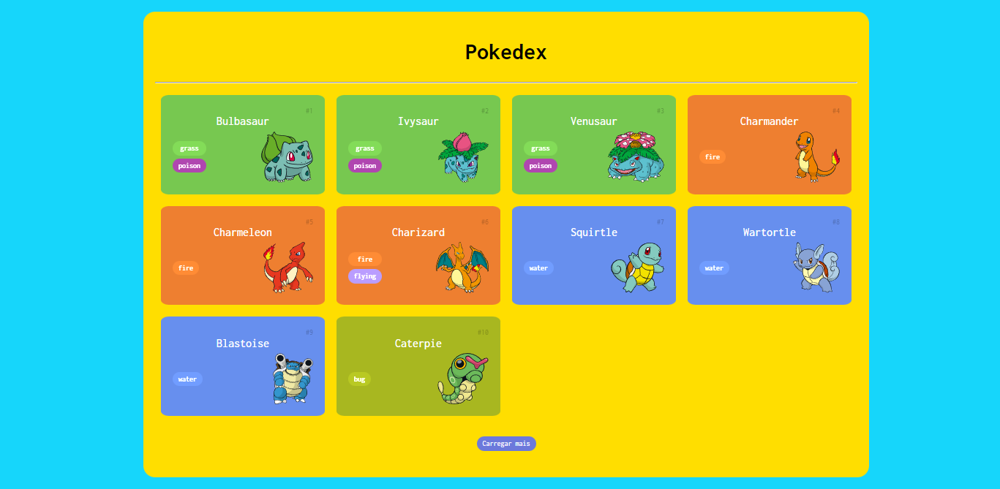
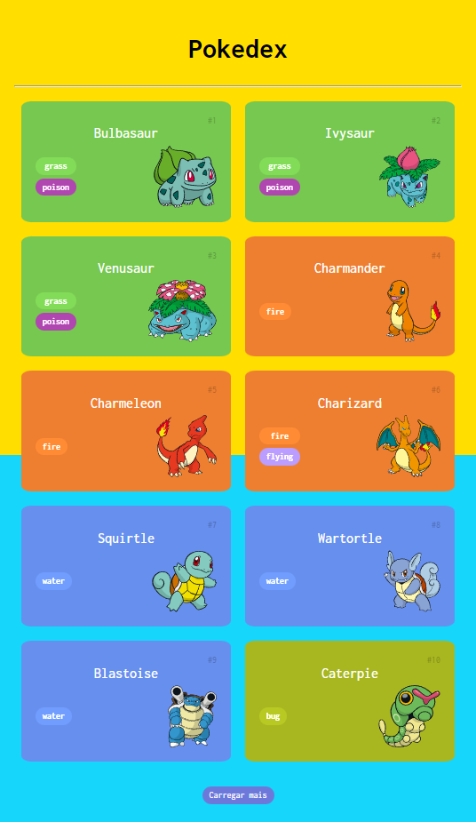

# DIO - NTT DATA Diversidade em Tech

 !

[Acesse o projeto acessando aqui](https://danieltelesb.github.io/Pokedex)

Projeto responsivo desenvolvido a partir da trilha de JS do bootcamp - NTT DATA Diversidade em Tech. 

## Tecnologias
- Html
- Css
- JavaScript
- Git e Github

## Oque aprendi 
- Funções de JavaScript
- Criar objetos e classes em 
- Arrays e Estruturas de repetição
- Importação e Exportação
- Desenvolvimento Web 
- Listagem de pokémons
- Protocolo HTTP e entegação com a PokeAPI

##  Contato

dantelx12@gmail.com